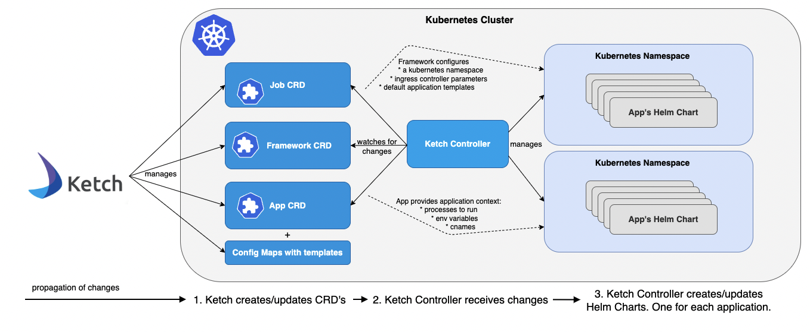

[](https://travis-ci.com/shipa-corp/ketch)
[](https://shipa-io.slack.com/archives/C01E4FMEY9K)

Think applications not yamls :)

# What is Ketch
Ketch is an application delivery framework that facilitates the deployment and management of applications on Kubernetes using a simple command line interface. No YAML required!

# Contents
* [Ketch Overview](https://learn.theketch.io/docs/overview)
* [Architecture](https://learn.theketch.io/docs/architecture)
* [Getting Started](#getting-started)
* [Deploying a sample application](https://learn.theketch.io/docs/getting-started#deploying-an-application)  
* [Get Involved](#get-involved)
  * [Office Hours](#office-hours)
  * [Developer Guide](./CONTRIBUTING.md)

## Architecture Diagram


## Getting Started

### Download and Install Ketch
The latest Ketch release can be found [here](https://github.com/shipa-corp/ketch/releases). Use the following commands
to install Ketch,

Install latest at /usr/local/bin default location

```bash
curl -s https://raw.githubusercontent.com/shipa-corp/ketch/main/install.sh | bash
```

Alternatively, you can install specific tag at a target location, for example command below installs ketch version v0.3.1 in current directory:

```bash
curl -s https://raw.githubusercontent.com/shipa-corp/ketch/main/install.sh | INSTALL_DIR=. TAG=v0.3.1  bash
```


### Install Ingress Controller

At present, Ketch supports Istio and Traefik ingress controllers.

Here is how you can install Traefik:

Use [Helm](https://helm.sh/docs/intro/install/) to install Traefik.

```bash
helm repo add traefik https://helm.traefik.io/traefik
helm repo update
helm install traefik traefik/traefik
```

Or you can install Istio:

```bash
curl -Ls https://istio.io/downloadIstio | ISTIO_VERSION=1.9.0 sh -
export PATH=$PWD/istio-1.9.0/bin:$PATH
istioctl install --set profile=demo
```

### Install Cert Manager.
```bash
kubectl apply --validate=false -f https://github.com/jetstack/cert-manager/releases/download/v1.0.3/cert-manager.yaml
```
### Install Ketch controller.
```bash
kubectl apply -f https://github.com/shipa-corp/ketch/releases/download/v0.3.1/ketch-controller.yaml
```

Thats it!

## Using Ketch

Learn more about Ketch at [Ketch documentation](https://learn.theketch.io/docs)

### Quick Start
Deploying apps is easy once you've installed Ketch.  First, create a framework. Then create app(s) adding them to the framework and finally
deploy the app(s).  The following example illustrates these steps.

```bash
# Add a framework with ingress Traefik (default), replace ingress IP address by your ingress IP address
ketch framework add myframework  --ingress-service-endpoint 35.247.8.23 --ingress-type traefik

# Deploy app using docker image
ketch app deploy -k myframework bulletinboard -i docker.io/shipasoftware/bulletinboard:1.0

# Check app status
ketch app list

NAME             FRAMEWORK   STATE             ADDRESSES                                      BUILDER    DESCRIPTION
bulletinboard    myframework      1 running    http://bulletinboard.35.247.8.23.shipa.cloud
```
After you deploy your application, you can access it at the address associated with it using the `ketch app list`, in
this example `bulletinboard.35.247.8.23.shipa.cloud`.

### Usage
For details see https://theketch.io.

```bash
Usage:
  ketch [flags]
  ketch [command]

Available Commands:
  app         Manage applications
  cname       Manage cnames of an application
  env         Manage an app's environment variables
  help        Help about any command
  builder     Manage pack builders
  framework   Manage frameworks
  unit        Manage an app's units

Flags:
  -h, --help      help for ketch
  -v, --version   version for ketch

Use "ketch [command] --help" for more information about a command.
```

## Shell autocompletion

Ketch supports shell autocompletion for:
- bash
- zsh
- fish
- PowerShell

To get instructions on how to install shell autocompletion use following command:
`ketch completion -h`

## Get Involved

* Discuss Ketch on [slack](https://join.slack.com/t/shipaco/shared_invite/zt-mqy8plp1-DxFKP102VJtUn5q9tzom9Q) or our [dev mailing list](https://groups.google.com/g/ketch-dev)
* Join [office hours](#office-hours)

## Office Hours
Ketch office hours aim is to listen from the community, share ideas, experiences and ask questions. In this meeting Ketch maintainers are going to look for new ideas, feature requests, answer any questions related to uses of Ketch, contributing to Ketch or any other questions/suggestions.

Ketch office hours takes place every other Wednesday at 4:30pm UTC/8:30am PST. Summer (daylight time): 3:30pm UTC/8:30am PDT. Check our [Event calendar](https://calendar.google.com/calendar/embed?src=48oaii5hknjo6vbrhq8lgqg0c8%40group.calendar.google.com&ctz=America%2FLos_Angeles) and [check your local time](https://www.thetimezoneconverter.com/?t=16:30&tz=UTC).

* Join [Ketch mailing group](https://groups.google.com/g/ketch-dev) to stay connected with office hour and other ketch community events
* [Office hour agenda and running notes](https://docs.google.com/document/d/1E5SJx5pTe2ZsEY60A5FFThv931Euw2Pmr-MvoBU510s/edit#)
* [Event calendar](https://calendar.google.com/calendar/embed?src=48oaii5hknjo6vbrhq8lgqg0c8%40group.calendar.google.com&ctz=America%2FLos_Angeles)


## Developer Guide [See Contributing](./CONTRIBUTING.md)
